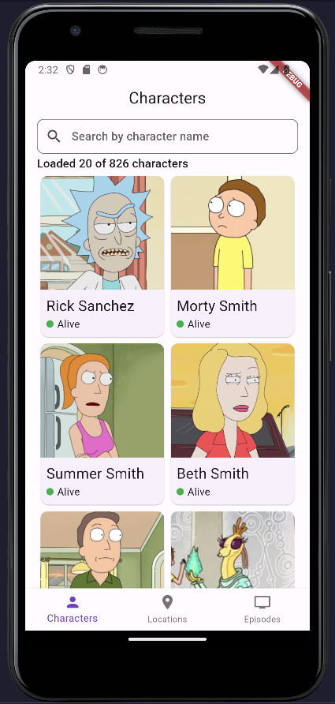
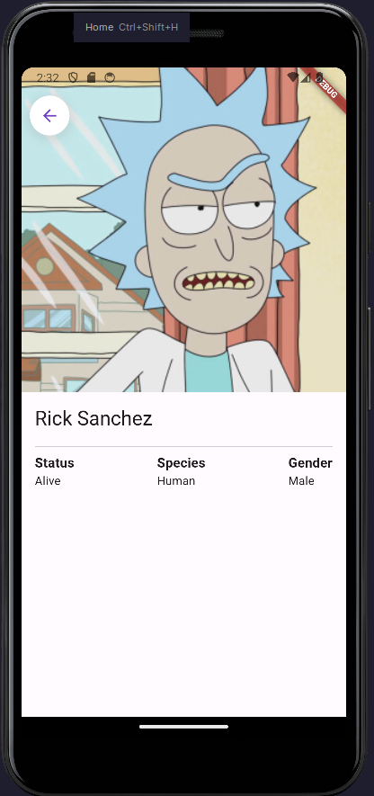
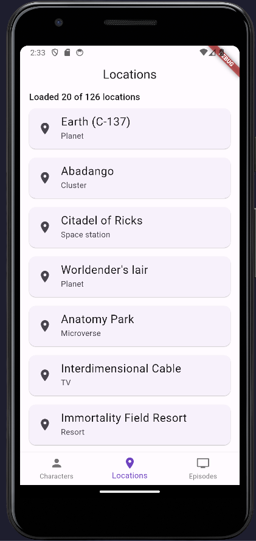
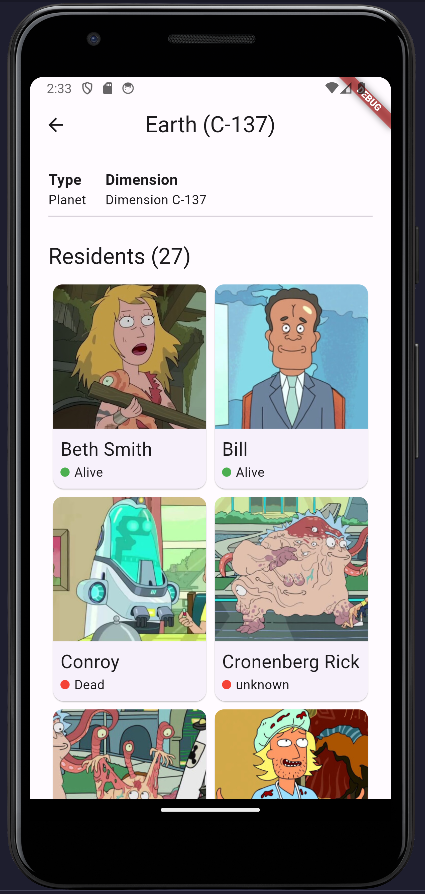
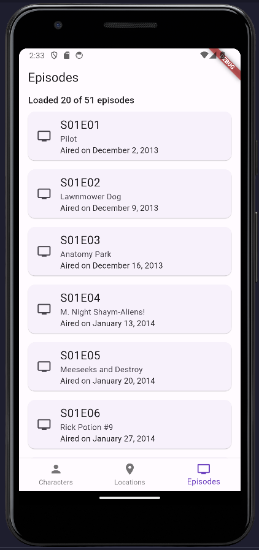
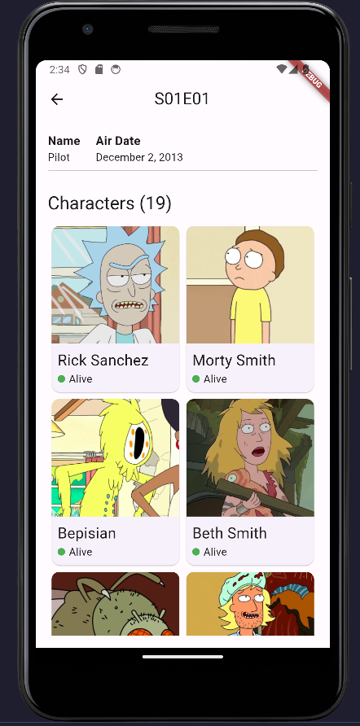

# rickandmorty

### Table of Contents
- [Installation](#installation)
- [Features](#features)
- [Architecture](#architecture-proposal)
- [Dependencies](#dependencies)
- [Screenshots](#screenshots)

## Installation

- Run `git clone https://github.com/cjamcu/rickandmorty.git` to clone the repository
- Run `cd rickandmorty` to enter the project directory
- Run `flutter pub get` to install dependencies
- Run `flutter run` to run the app
- 
## Features

- [x] View all characters with infinite scrolling
- [x] Search for characters by name
- [x] View character details
- [X] View all Locations with infinite scrolling 
- [x] View Location details 
- [X] View all Episodes with infinite scrolling
- [x] View Location details 

## Architecture Proposal

The architecture of the project is based on the Clean Architecture. This architectural pattern promotes separation of
concerns and maintainability by dividing the project into distinct layers: presentation, domain, and data.

### Presentation Layer

In the presentation layer, we handle the user interface, application logic, and state management using the BLoC pattern.
Each screen corresponds to a Bloc which manages the state and interactions of the UI components.

### Domain Layer

The domain layer contains the core business logic of the application. It includes use cases that encapsulate the
interactions between the presentation and data layers. The entities in this layer represent the core data structures,
while the repositories define the contract for data retrieval.

### Data Layer

The data layer is responsible for interacting with external data sources, such as APIs or databases. It includes the
implementation of the repositories defined in the domain layer, as well as data models that map to the external data
structures.

Using this architecture has several benefits, including:

- **Modularity:** Each layer is independent, making it easier to replace or modify components without affecting the
  entire system.
- **Testability:** The separation of concerns allows for easier unit testing of individual components.
- **Scalability:** The architecture is designed to accommodate growth and new features without compromising the existing
  codebase.

Image Source: [Platzi](https://platzi.com/clases/1603-flutter-avanzado/20221-bloc-clean-architecture-en-flutter/)

## Dependencies

We've leveraged a range of external dependencies to enhance the functionality and performance of the app. Each
dependency serves a specific purpose, contributing to the overall experience:
- equatable: ^2.0.5
- flutter_bloc: ^8.1.3
- bloc: ^8.1.2
- get_it: ^7.6.2
- responsive_grid: ^2.4.4
- cached_network_image: ^3.2.3
- http: ^1.1.0

## Screenshots

  
  
  

